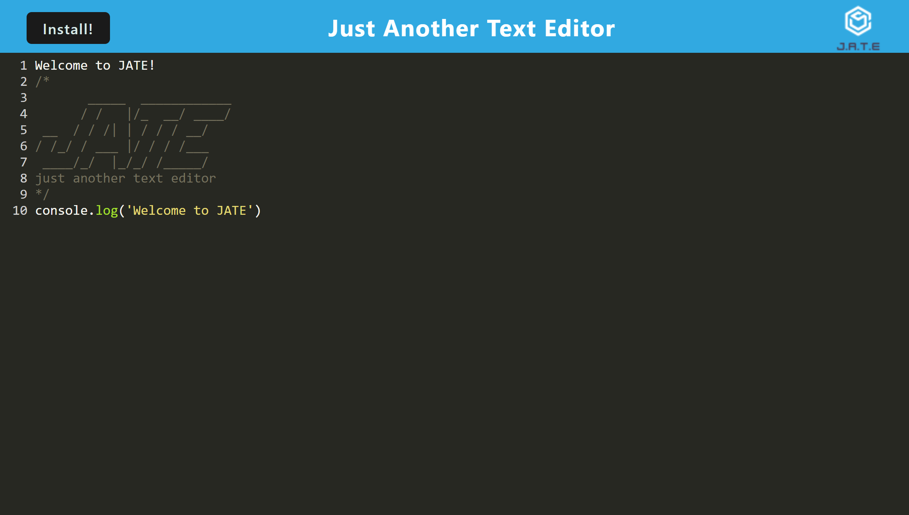

# PWA Text Editor

Module 19: Progressive Web Applications (PWA)

## Table of Contents
1. [Description](#description)
2. [Submission](#submission)
3. [Usage](#usage)
4. [Visuals](#visuals)

## Description
This application is a text editor that runs in the browser. The app is a single-page application that meets the PWA criteria. It features a number of data persistence techniques that serve as redundancy in case one of the options is not supported by the browser. In addition, this app can function while offline.

[GitHub Repo](https://github.com/alyssa20lopez/text-editor)

## Submission

[Heroku Link](https://pwa-text-editor22.herokuapp.com/)
## Usage
To use this application, first clone the project and navigate to VS Code. The following packages were installed through the command-line:
- `npm i` 
- `npm i idb` (A small wrapper around the IndexedDB Api and features methods that are useful for storing and retrieving data, an dis used by companies such as, Google and Mozilla)

To start application, run `npm run start:dev`

## Visuals
Here is a visual of the front-end of the webpage design!

